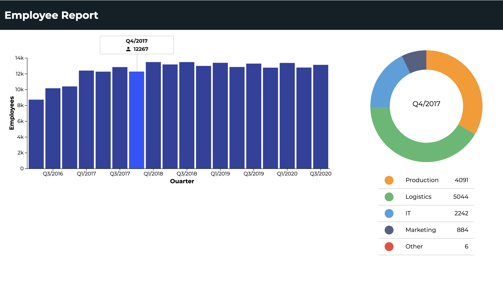

# d3-data-visualization-demo
A data visualization showcase application written in JS/HTML/CSS.
This demo application shows an example of how to create visualizations with the d3.js framework.

## Data
The data is loaded from a static JSON file via a fake async request.
Transforming this to an actual HTTP-Request is possible with little effort.

## Application
